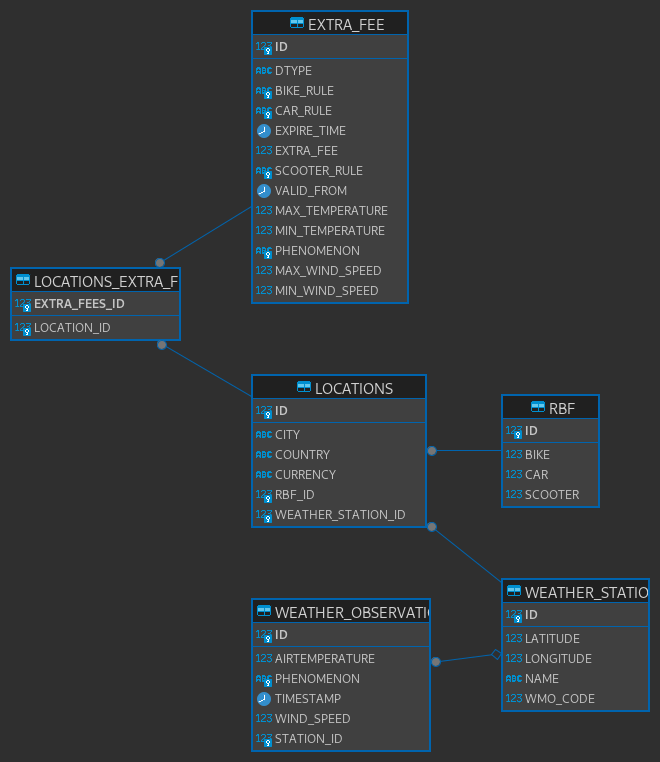

# Fujitsu Java programming trial task

The objective of the task is to develop a sub-functionality for a food delivery application, which
calculates the delivery fee for food couriers based on regional base fee, vehicle type and weather conditions.

The project is written using following technologies:
* Java 17
* Springboot
* H2

## Implemented features

The list of implemented features are following:  
* REST interface, which enables querying the delivery fee based on input parameters (including historical data when specific timestamp is specified in the request)
* Configurable scheduled task for importing weather observations from Ilmateenistus XML ticker API
* Business rules CRUD interface

## Quick-start guide

Please keep in mind that this project has been developed and tested on OpenJDK 17 and as such it is the recommended JDK to use for building and running this application.
Other JDK implementations might also work but the compatibility is not fully guaranteed.

The quickest way to build and package the fee application is by using `Maven`. Doing so is relatively straight forward.

On Linux/MacOS
```
./mvnw package
```

On Windows
```
.\mvnw.cmd package
```

### Configuring the application

The application's configuration is based around internal `application.properties` file, which contains sane defaults for development purposes but should be overriden for any 
potential production environments. The configuration values can be supplemented when needed by using appropriate spring environment properties. For instance let's say that
the configuration values are held at `/path/to/overriden.properties`. In that case the application should be run with following commandline arguments:  
```
java -jar feeservice-1.0.0-SNAPSHOT.jar --spring.config.location=/path/to/overriden.properties
```

An example properties file can look something like this:  
```
spring.datasource.url=jdbc:h2:file:./data/db
spring.datasource.driverClassName=org.h2.Driver
spring.jpa.hibernate.ddl-auto=update
spring.jpa.database-platform=org.hibernate.dialect.H2Dialect
scheduling.weatherimport.cron=0 15 * * * ?
spring.datasource.username=courierfee
spring.datasource.password=password123
spring.h2.console.enabled=false
```

Overriding `application.properties` allows us to define the general behaviour of the application such as the cron value for scheduled weather data imports,
DBMS, database credentials and spring datasource driver. 

### Seeding the database with initial data

Although the implementation has a CRUD interface for defining business rules, it might become tedious to define all predefined rules manually (as mentioned in the requirements document). 
In order to simplify the database initialization process, it is possible to have the database initialized with predefined data by simply making one HTTP request.
```seeding
GET /api/admin/data/init
```
This request only works when all database tables are empty, otherwise it will fail with an error message.

## REST api endpoints

In general the API endpoints can be summarized with following bullet list:  
* `GET /api/admin/data/init` represents database initialization endpoint, which only succeeds when all database tables are empty.
* `GET /api/courierfee?city=<city>&vehicle=<vehicle>[&unixTimestamp=<ts>]` represents courier fee calculation endpoint, where
  * `<city>` represents the city name where the courier is currently working. Initially the database gets seeded with `Tallinn`, `Tartu` and `Pärnu`.
  * `<vehicle>` represents the type of vehicle courier is using. Valid values are `car`, `scooter`, `bike` (case insensitive).
  * `<ts>` optionally specifies the Unix timestamp at which point in time the returned fee was valid.
* `GET /api/locations/{id}` represents single location read endpoint for business logic CRUD
  * `/{id}` specifies the id of the location to query for
* `GET /api/locations` represents READ all endpoint for business logic CRUD
* `POST /api/locations` represents CREATE new endpoint for business logic CRUD
* `PUT /api/locations/{id}` represents UPDATE endpoint for business logic CRUD
  * `/{id}` specifies the id of the location to update
* `DELETE /api/locations/{id}` represents DELETE endpoint for business logic CRUD
  * `/{id}` specifies the id of the location to delete

## Business logic CRUD

In order to properly understand how to use the business logic CRUD interface, let's first get an idea how the data is structured in the database.
The following entity relation diagram showcases the layout of all tables in the database and relations between them. 


The ERD shows that most relations between tables are either directly or indirectly associated with `Location` entity, which is also the reason why business 
logic CRUD interface endpoints start with `/api/locations...` path. When making a single location `GET` request the response body might look something like this:  
```json
{
  "id": 1,
  "country": "Estonia",
  "city": "Tallinn",
  "currency": "EUR",
  "regionalBaseFee": {
    "id": 1,
    "car": 4.00,
    "scooter": 3.50,
    "bike": 3.00
  },
  "extraFees": [
    {
      "extraFeeType": "AirTemperatureExtraFee",
      "id": 1,
      "validFrom": "2024-03-15T15:43:29.762671",
      "expireTime": null,
      "extraFee": 1.00,
      "carRule": "NOT_APPLICABLE",
      "scooterRule": "APPLICABLE",
      "bikeRule": "APPLICABLE",
      "minTemperature": null,
      "maxTemperature": -10.0,
      "valid": true
    },
    ...
  ],
  "weatherStation": {
    "id": 1,
    "name": "Tallinn-Harku",
    "wmoCode": 26038,
    "longitude": 24.602891666624284,
    "latitude": 59.398122222355134
  }
}
```

Upon successful request the response body contains the specified `Location` instance with data from other related entities as described in the entity relation diagram.
Those other related entities are given as `regionalBaseFee`, `extraFees` and `weatherStation` objects in the response JSON. This JSON structure is also used 
for creating and updating business rules but with some differences. For instance neither create (POST) nor update (PUT) requests require the presence of entity 
IDs in the request body. (update requests do require ID's but they are specified in the request URL)

### Extra fee rules

Extra fee rules determine how or if the courier fee should be calculated based on the current (or historical) weather observation. Each rule defines
one weather condition, a set of values defining how given rule affects each vehicle type, the amount of money to add as extra fee for applicable vehicle types,
valid from timestamp and expiry timestamp.

There are three types of extra fee rules that can be used: `AirTemperatureExtraFee`, `WindSpeedExtraFee` and `WeatherPhenomenonExtraFee`.
Declaring extra fees in the request body also requires the explicit declaration of the fee type.

#### Creation request examples

*AirTemperatureExtraFee*
```json
{
  "extraFeeType": "AirTemperatureExtraFee",
  "extraFee": 1.00,
  "carRule": "NOT_APPLICABLE",
  "scooterRule": "APPLICABLE",
  "bikeRule": "APPLICABLE",
  "minTemperature": null,
  "maxTemperature": -10.0
}
```
When the courier is delivering food by bike or scooter and the air temperature is under -10°C, they get 1€ extra for the delivery.

*WindSpeedExtraFee*
```json
{
  "extraFeeType": "WindSpeedExtraFee",
  "extraFee": 0.50,
  "carRule": "NOT_APPLICABLE",
  "scooterRule": "NOT_APPLICABLE",
  "bikeRule": "APPLICABLE",
  "minWindSpeed": 10.0,
  "maxWindSpeed": 20.0
}
```
When the courier is delivering food by bike and the wind speed is between 10 m/s and 20 m/s, they get 0.5€ extra for the delivery.

*WeatherPhenomenonExtraFee*
```json
{
  "extraFeeType": "WeatherPhenomenonExtraFee",
  "extraFee": 1.00,
  "carRule": "NOT_APPLICABLE",
  "scooterRule": "APPLICABLE",
  "bikeRule": "APPLICABLE",
  "phenomenon": "SNOW"
}
```
When the courier is delivering food by bike and it is snowing, they get 1€ extra for the delivery. 